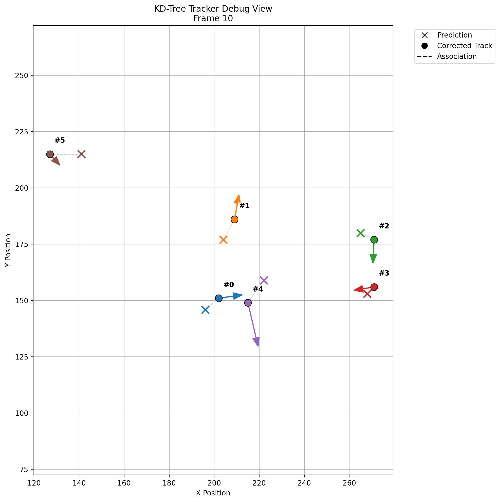

# C++ Practice & Autonomous Systems Preparation

This repository contains my C++ projects and systems-focused engineering work as I build toward developing software for autonomous driving, perception, robotics, and real-time systems.

This repository follows a milestone-based development approach where each project builds upon the previous one to gradually construct the foundations of an autonomous perception stack.

Rather than relying on existing perception frameworks, each component is implemented from first principles to develop a deeper understanding of the algorithms, data structures, software architecture, and evaluation techniques used in modern perception systems.

The goal of this repository is to strengthen:

- Core C++ programming skills
- Data structures and algorithms
- Systems thinking
- Spatial reasoning and tracking
- Foundations for perception pipelines

---

## Highlights

- Modular C++ multi-object tracking system
- KD-tree accelerated data association
- Constant-velocity motion prediction
- Synthetic benchmark generation
- Quantitative prediction error evaluation
- Trajectory visualization
- Tracker debugging visualization

---

# 📁 Repository Structure

```text
cpp-autonomy-foundations/
├── basics/
├── data_structures/
├── tracking/
├── perception_pipeline/
└── README.md
```

---

## Basics/

Introductory programs focused on core C++ concepts:

- Input/output (`cin`, `cout`)
- Control flow (`if`, `switch`, loops)
- Input validation
- Basic problem solving

### Current Programs

- `hello.cpp` – user input and output
- `calculator.cpp` – basic arithmetic with error handling
- `even-odd.cpp` – determining if user input is an even or odd integer
- `vector-average.cpp` – finding the average of a collection of numbers using vectors
- `max-number.cpp` – finding the maximum value in a collection

---

## DataStructures/

Programs focused on building fundamental data structures and algorithms.

### Current Programs

- `distance-two-points.cpp` – computes the distance between two `(x,y)` coordinates
- `nearest-point.cpp` – returns the nearest point in a collection relative to a queried point
- `kdtree.cpp` – implements a 2D KD-Tree using recursive spatial partitioning and nearest-neighbor search

### Key Concepts

- Recursive tree construction
- Spatial partitioning
- Nearest-neighbor search
- Search pruning
- Algorithm optimization

---

## Tracking/

Projects focused on object tracking and state management across frames.

### Multi-Frame Object Tracker ⭐

A modular C++ tracking system that maintains object identities across sequential frames using:

- KD-tree accelerated data association
- Frame-aware observations
- Persistent track identities
- Trajectory history
- Missed-frame handling
- Automatic stale-track deletion

### Key Concepts

- Multi-frame tracking
- State management over time
- Object lifecycle management
- KD-tree integration
- Real-time systems thinking

See: `tracking/README.md`

---

## PerceptionPipeline/

Projects focused on moving from manually entered detections toward perception-style data pipelines.

### Current Features

- File-based frame ingestion
- Automatic frame discovery
- KD-tree accelerated data association
- Constant-velocity motion prediction
- Configurable tracker parameters
- Prediction error evaluation
- Synthetic traffic generation
- Benchmark datasets
- Trajectory export (CSV)
- Frame state export (CSV)
- Trajectory visualization
- Tracker debug visualization

### Pipeline Architecture

```text
Synthetic Traffic Generator
          ↓
Frame Files
          ↓
Frame Loader
          ↓
Motion Prediction
          ↓
KD-Tree Association
          ↓
Tracker Update
          ↓
Evaluation Metrics
          ↓
      ┌───────────────┐
      │               │
Trajectory Export   Frame Export
      │               │
      ▼               ▼
Trajectory Plot   Tracker Debug View
```

### Trajectory Visualization


Shows the complete tracked trajectory of every object throughout the scenario.

---

### Tracker Debug Visualization



Shows the internal state of the tracker for a single frame, including predicted positions, corrected positions, association errors, velocity estimates, and persistent track identities.

---

# 🛠️ How to Compile and Run

### Compile

```bash
clang++ -std=c++17 -Wall -Wextra Basics/calculator.cpp -o calculator
```

### Run

```bash
./calculator
```

---

# 🎯 Autonomous Systems Roadmap

## Phase 1 — C++ Fundamentals ✅

### Projects

- Hello Input
- Calculator
- Even/Odd
- Vector Average
- Max Number

### Skills

- Loops
- Conditionals
- Functions
- Vectors
- Input validation

---

## Phase 2 — Spatial Algorithms ✅

### Projects

- Distance Between Points
- Nearest Neighbor Search
- KD-Tree

### Skills

- Geometry
- Spatial search
- Recursion
- KD-tree construction
- Search optimization

---

## Phase 3 — Tracking Systems ✅

### Projects

- Multi-Frame Object Tracker

### Skills

- Persistent object identities
- Trajectory history
- KD-tree accelerated matching
- Lifecycle management
- State management over time

---

## Phase 4 — Perception Pipeline Foundations 🚧

### Completed

- File-based detection ingestion
- KD-tree accelerated data association
- Constant-velocity motion prediction
- Configurable tracker parameters
- Prediction error evaluation
- Synthetic traffic generation
- Benchmark datasets
- Trajectory visualization
- Tracker debug visualization

### Next Milestone

- Constant-velocity Kalman filter
- Curved-motion benchmark datasets
- False detections and missed detections
- Animated tracker visualization

---

# 🏁 Current Milestone

Completed

- ✅ KD-tree implementation
- ✅ Multi-frame tracking
- ✅ Constant-velocity prediction
- ✅ Benchmark generation
- ✅ Prediction error evaluation
- ✅ Trajectory visualization
- ✅ Tracker debug visualization

Currently Working On

- 🚧 Constant-velocity Kalman filter

Future Goals

- ⬜ Hungarian assignment
- ⬜ Curved-motion benchmark datasets
- ⬜ False detections
- ⬜ Animated tracker visualization
- ⬜ OpenCV integration
- ⬜ Video-based perception

---

# 🚀 Current Focus

Building a perception pipeline foundation by separating:

```text
Synthetic Traffic Generator
          ↓
Frame Files
          ↓
Frame Loader
          ↓
Motion Prediction
          ↓
KD-Tree Association
          ↓
Tracking Update
          ↓
Evaluation
          ↓
Visualization
```

---

# 📌 Notes

- This repository focuses on incremental learning and systems development.
- Projects evolve from foundational C++ concepts into larger autonomy-oriented systems.
- All implementations are built from scratch to develop a deeper understanding of the underlying algorithms and architecture.
- The long-term goal is to build toward perception, tracking, and autonomous systems software.