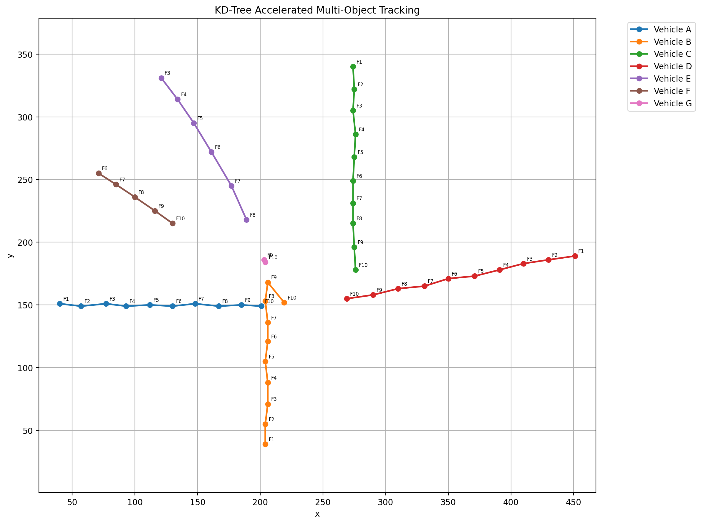

# Perception Pipeline Foundations (C++)

This project is the next step after the multi-frame object tracker. It begins to separate detection input from tracking logic by loading detections from files instead of relying on terminal input.

The goal of this phase is to build the foundations of a perception-style pipeline that can eventually support simulation input, visualization, and real detection sources.

---

# Project Goals

The purpose of this project is to move from manual point entry to a more realistic data flow:

1. Load detections from frame files
2. Pass detections into the tracker
3. Maintain object identities across frames
4. Track trajectories over time
5. Prepare the codebase for future perception and visualization work

This phase bridges the gap between a terminal-based tracker and a more complete perception system.

---

# Features

- File-based frame loading
- Automatic frame discovery
- Synthetic traffic generation
- KD-tree accelerated nearest-neighbor matching
- Persistent track identities
- Frame-aware trajectory history
- Missed-frame handling
- Stale-track deletion
- Trajectory export to CSV
- Python-based trajectory visualization

---

# Project Structure

```text
perception-pipeline/
├── frames/
│   ├── intersection_demo/
│   │   ├── frame_01.txt
│   │   ├── frame_02.txt
│   │   └── ...
│
├── output/
│   ├── track_0.csv
│   ├── track_1.csv
│   └── trajectory_plot.png
│
├── frame_loader.hpp
├── frame_loader.cpp
├── trajectory_export.hpp
├── trajectory_export.cpp
├── generate_traffic_frames.py
├── visualize_tracks.py
├── main.cpp
└── README.md
```

---

# File Responsibilities

## `frame_loader.hpp / frame_loader.cpp`

Handles reading detection points from text files and converting them into `Point` objects.

## `main.cpp`

Coordinates the pipeline:

- Loads each frame
- Sends detections to the tracker
- Updates tracks
- Prints results

## `Tracking/` Module

Provides:

- `Track`
- `Observation`
- KD-tree matching
- Trajectory history
- Track lifecycle management

---

# Frame Format

Each frame file contains one detection per line in the following format:

```text
x y
```

Example:

```text
100 200
300 400
500 500
```

---

# Synthetic Traffic Generator

The pipeline includes a synthetic traffic generator that creates realistic frame-by-frame detections.

Current scenarios include:

- Horizontal traffic
- Vertical traffic
- Crossing traffic
- Late-entering vehicles
- Merge-like behavior
- Curved trajectories

Generate a dataset:

```bash
python3 generate_traffic_frames.py \
    --output frames/intersection_demo \
    --frames 10 \
    --clear
```

The generated frames are then consumed directly by the perception pipeline.

---

# Pipeline Flow

The current perception pipeline follows the architecture below:

```text
Synthetic Traffic Generator
          ↓
Frame Files
          ↓
Frame Loader
          ↓
Detection List
          ↓
KD-Tree Matching
          ↓
Tracker Update
          ↓
Trajectory Export (CSV)
          ↓
Trajectory Visualization
```

This structure separates detection input from tracking logic, which is an important step toward perception systems.

---

# Example Demo Run

## Input Files

### `frames/frame1.txt`

```text
100 200
300 400
```

### `frames/frame2.txt`

```text
105 205
298 398
700 700
```

### `frames/frame3.txt`

```text
110 210
705 705
```

---

## Example Output

```text
====================================
Frame 1
====================================
Initialized tracks from frames/frame1.txt

====================================
Frame 2
====================================
[Match] (105, 205) -> Track 0
[Match] (298, 398) -> Track 1
[New]   (700, 700) -> Track 2

Track 0 [missed=0]
  Path: F1(100,200) -> F2(105,205)

Track 1 [missed=0]
  Path: F1(300,400) -> F2(298,398)

Track 2 [missed=0]
  Path: F2(700,700)

====================================
Frame 3
====================================

[Match] (110, 210) -> Track 0
[Match] (705, 705) -> Track 2

Track 0 [missed=0]
  Path: F1(100,200) -> F2(105,205) -> F3(110,210)

Track 1 [missed=1]
  Path: F1(300,400) -> F2(298,398)

Track 2 [missed=0]
  Path: F2(700,700) -> F3(705,705)
```

---

# Visualization

Trajectory data is exported as CSV files and visualized using a Python plotting utility.

Generate the visualization:

```bash
python3 visualize_tracks.py
```

Example output:



Each colored trajectory represents a tracked object.

Frame labels (`F1`, `F2`, etc.) indicate temporal progression and demonstrate persistent object identity across frames.

---

# Why This Phase Matters

This project is the first step toward a larger perception pipeline because it introduces:

- Structured input ingestion
- Separation of detection from tracking
- Reusable system components
- Pipeline-style thinking

Instead of manually typing points into the terminal, the tracker now consumes detections from files, which is closer to how perception systems work in practice.

---

# Current Limitations

The current implementation intentionally keeps the perception pipeline simple.

Known limitations:

- Frame data comes from synthetic detections rather than real sensors
- Matching is still greedy and not globally optimal
- No motion prediction (Kalman filtering)
- No image or video processing yet
- No OpenCV integration yet
- No Hungarian assignment optimization

---

# Future Improvements

Planned next steps include:

- More realistic traffic simulation scenarios
- Hungarian algorithm assignment
- Kalman filter motion prediction
- OpenCV-based visualization
- Video-based detections
- Real sensor integration
- End-to-end perception pipeline development

---

# Learning Outcomes

This project strengthens:

- File I/O
- Data ingestion
- Modular C++ design
- Pipeline architecture
- Tracking system integration
- Systems thinking for perception-style software

---

# Relationship to the Tracker Project

This folder builds directly on the work done in the `tracking/` folder.

The `tracking/` module provides the tracking engine, while this folder focuses on how detections enter the system and flow through the pipeline.

Together, they form the foundation for a future perception-style application.

---

# Development Progress

Completed:

- ✅ File-based detection ingestion
- ✅ Automatic frame discovery
- ✅ KD-tree accelerated tracking
- ✅ Trajectory export (CSV)
- ✅ Synthetic traffic generation
- ✅ Trajectory visualization

In Progress:

- 🚧 Perception pipeline foundations

Planned:

- ⬜ Motion prediction
- ⬜ Assignment optimization
- ⬜ Video-based perception
- ⬜ OpenCV integration