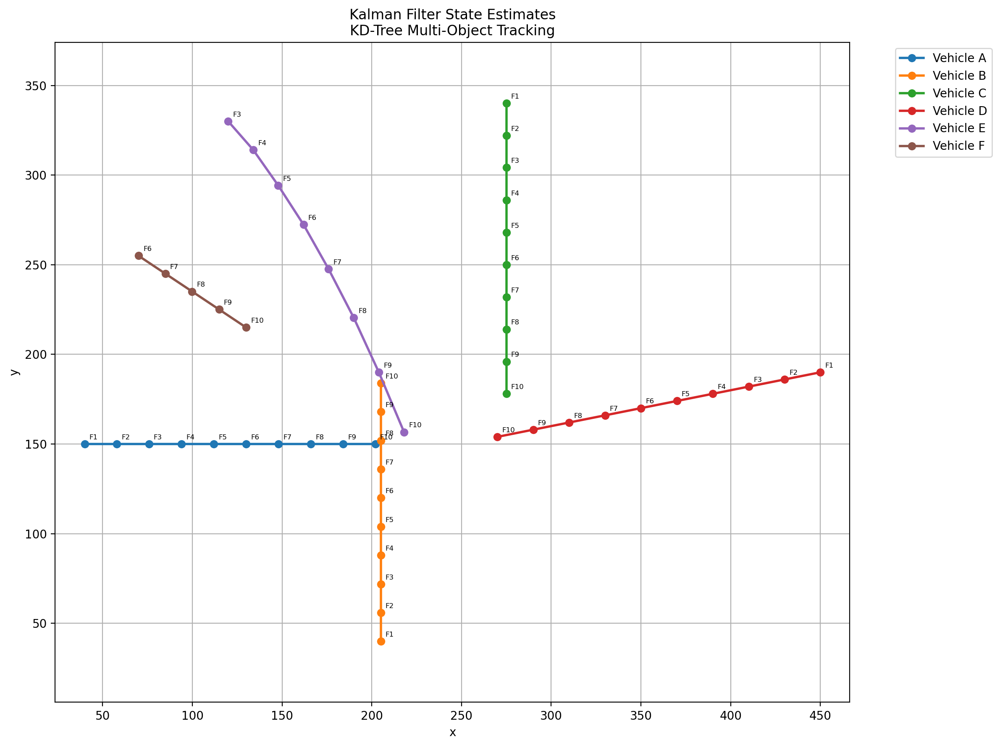
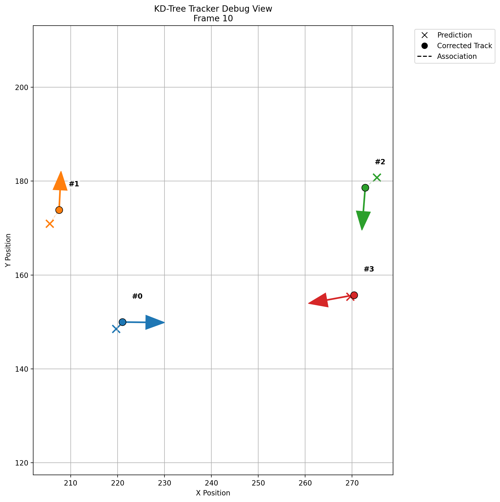

# Perception Pipeline Foundations (C++)

This project implements a modular C++ perception pipeline for multi-object tracking. It builds on the standalone tracking library by integrating file-based detection ingestion, motion prediction, benchmark generation, quantitative evaluation, and visualization into a cohesive perception workflow.

The project demonstrates how detections flow through a perception pipeline:

→ Frame Detections
→ Motion Prediction
→ KD-Tree Data Association
→ Track Update
→ Evaluation
→ Visualization

Rather than focusing solely on tracking accuracy, the project emphasizes modular software architecture, reproducible benchmarking, and debugging tools commonly used in autonomous perception systems.

---

# Project Goals

The purpose of this project is to move from manual point entry to a more realistic data flow:

1. Load detections from frame files
2. Pass detections into the tracker
3. Maintain object identities across frames
4. Track trajectories over time
5. Evaluate tracking performance using quantitative metrics
6. Export trackings tate for visualization and debugging
7. Build a modular architecture suitable for future Kalman filtering and senor integration

This phase bridges the gap between a terminal-based tracker and a more complete perception system.

---

# Features

- File-based frame loading
- Automatic frame discovery
- Synthetic traffic generation
- KD-tree accelerated nearest-neighbor association
- Constant-velocity Kalman Filter state estimation
- Tuned Kalman filter parameters
- Standalone Kalman filter validation
- Configurable tracking parameters
- Prediction error evaluation
- Persistent track identities
- Missed-frame handling
- Stale-track deletion
- Trajectory export (CSV)
- Frame state export (CSV)
- Trajectory visualization
- Tracker debug visualization

---

# Project Structure

```text
perception-pipeline/
├── frames/
│   ├── intersection_demo/
│   │   ├── frame_01.txt
│   │   ├── frame_02.txt
│   │   └── ...
│
├── output/
│   ├── track_0.csv
│   ├── track_1.csv
│   ├── frame_data.csv
│   ├── tracker_frame_10.png
│   └── trajectory_plot.png
│
├── frame_loader.hpp
├── frame_loader.cpp
├── trajectory_export.hpp
├── trajectory_export.cpp
├── frame_export.hpp
├── frame_export.cpp
├── generate_traffic_frames.py
├── visualize_tracks.py
├── main.cpp
└── README.md
```

---

# File Responsibilities

## `frame_loader.hpp / frame_loader.cpp`

Handles reading detection points from text files and converting them into `Point` objects.

## `frame_export.hpp / frame_export.cpp`

Exports tracker state for every successful association, including predicted positions, corrected positions, velocity estimates, and prediction errors. This data powers the tracker debug visualization.

## `main.cpp`

Coordinates the pipeline:

- Loads each frame
- Sends detections to the tracker
- Updates tracks
- Prints results

## `Tracking/` Module

Provides:

- `Track`
- `Observation`
- KD-tree matching
- Trajectory history
- Track lifecycle management

---

# Frame Format

Each frame file contains one detection per line in the following format:

```text
x y
```

Example:

```text
100 200
300 400
500 500
```

---

# Synthetic Traffic Generator

The pipeline includes a synthetic traffic generator that creates realistic frame-by-frame detections.

Current scenarios include:

- Horizontal traffic
- Vertical traffic
- Crossing traffic
- Late-entering vehicles
- Merge-like behavior
- Curved trajectories

Generate a dataset:

```bash
python3 generate_traffic_frames.py \
    --output frames/intersection_demo \
    --frames 10 \
    --clear
```

The generated frames are then consumed directly by the perception pipeline.

---

# Pipeline Flow

The current perception pipeline follows the architecture below:

```text
Synthetic Traffic Generator
          ↓
Frame Files
          ↓
Frame Loader
          ↓
Kalman State Estimation
          ↓
KD-Tree Association
          ↓
Track Update
          ↓
Evaluation Metrics
          ↓
      ┌───────────────┐
      │               │
Trajectory Export   Frame Export
      │               │
      ▼               ▼
Trajectory Plot   Tracker Debug View
```

This structure separates detection input from tracking logic, which is an important step toward perception systems.

---

# Kalman Filter State Estimation

The tracker uses a constant-velocity Kalman filter to estimate each object's position and velocity over time.

Rather than directly updating tracks from incoming detections, the tracker follows a two-stage prediction/correction cycle:

1. Predict the next state using the constant-velocity motion model.
2. Associate detections using KD-tree nearest-neighbor search.
3. Correct the predicted state using the matched detection.
4. Record the corrected state estimate in the track history.

Unlike the previous deterministic predictor, the Kalman filter maintains both a state estimate and an uncertainty estimate (covariance), allowing the tracker to gradually improve its prediction accuracy as additional observations become available.

---

# Example Demo Run

## Input Files

### `frames/frame1.txt`

```text
100 200
300 400
```

### `frames/frame2.txt`

```text
105 205
298 398
700 700
```

### `frames/frame3.txt`

```text
110 210
705 705
```

---

## Example Output

```text
====================================
Frame 1
====================================
Initialized tracks from frames/frame1.txt

====================================
Frame 2
====================================
[Match] (105, 205) -> Track 0
[Match] (298, 398) -> Track 1
[New]   (700, 700) -> Track 2

Track 0 [missed=0]
  Path: F1(100,200) -> F2(105,205)

Track 1 [missed=0]
  Path: F1(300,400) -> F2(298,398)

Track 2 [missed=0]
  Path: F2(700,700)

====================================
Frame 3
====================================

[Match] (110, 210) -> Track 0
[Match] (705, 705) -> Track 2

Track 0 [missed=0]
  Path: F1(100,200) -> F2(105,205) -> F3(110,210)

Track 1 [missed=1]
  Path: F1(300,400) -> F2(298,398)

Track 2 [missed=0]
  Path: F2(700,700) -> F3(705,705)
```

---

# Visualization

Trajectory data is exported as CSV files and visualized using a Python plotting utility.

Generate the visualization for tracker plot at a specific frame and saved to a specifc output directory:

```bash
python3 visualize_tracks.py \ --tracker \ --frame 10 \ --output output
```

Example output:



Each trajectory represents the Kalman Filter's corrected state estimate after incorporating each measurement. The resulting paths are smoother than the raw detections while preserving persistent object identities across frames.

Frame labels (`F1`, `F2`, etc.) indicate temporal progression and demonstrate persistent object identity across frames.

# Tracker Debug Visualization

The tracker exports frame-level debugging information that can be visualized independently of the trajectory plots.

The visualization displays:

- Predicted positions (×)
- Corrected track positions (●)
- Association lines
- Estimated velocity vectors
- Track identities

Example Output: 



---

# Benchmarking

The pipeline includes configurable synthetic datasets for evaluating prediction performance.

Current datasets include:

- Clean detections
- Noisy detections

Prediction quality is evaluated using:

- Average prediction error
- Maximum prediction error
- Successful associations
- Missed associations

These benchmarks provide a baseline for evaluating future motion models such as Kalman filtering.

---

# Kalman Filter Configuration

The Kalman filter parameters were empirically tuned using the synthetic benchmark datasets.

| Parameter | Value | Purpose |
|-----------|------:|---------|
| Initial Covariance (P₀) | 100 × I | High initial uncertainty allows rapid convergence during the first observations. |
| Process Noise (Q) | 0.1 × I | Models uncertainty in the constant-velocity motion model. |
| Measurement Noise (R) | 1.0 × I | Models uncertainty in the incoming detections. |

These values significantly improved prediction accuracy compared to the untuned baseline while maintaining identical association performance.

# Kalman Filter Evaluation

The tuned Kalman filter was evaluated using the synthetic benchmark datasets developed for this project.

| Configuration | Avg Prediction Error | Max Prediction Error | Successful Associations | Missed Associations |
|---------------|--------------------:|---------------------:|-------------------------:|--------------------:|
| Untuned Kalman Filter | 9.8859 | 24.4131 | 47 | 2 |
| Tuned Kalman Filter | **4.5203** | **21.2603** | 47 | 2 |

The tuned configuration reduced the average prediction error by approximately **54%** while preserving the same number of successful and missed associations.

---

# Why This Phase Matters

This project is the first step toward a larger perception pipeline because it introduces:

- Structured input ingestion
- Separation of detection from tracking
- Reusable system components
- Pipeline-style thinking

Instead of manually typing points into the terminal, the tracker now consumes detections from files, which is closer to how perception systems work in practice.

---

# Current Limitations

The current implementation intentionally keeps the perception pipeline simple.

Known limitations:

- Frame data comes from synthetic detections rather than real sensors
- Matching is still greedy and not globally optimal
- Uses a constant-velocity Kalman filter that assumes linear motion between observations
- No image or video processing yet
- No OpenCV integration yet
- No Hungarian assignment optimization

---

# Future Improvements

Planned next steps include:

Motion Models
- Adaptive process and measurement noise
- Constant-acceleration Kalman filter

Benchmarking
- Curved-motion scenarios
- False detections 
- Missed detections

Data Association
- Hungarian assignment

Visualization
- Animated tracker visualization

Perception
- OpenCV
- Real sensor integration

---

# Learning Outcomes

This project strengthens:

- File I/O
- Data ingestion
- Modular C++ design
- Pipeline architecture
- Tracking system integration
- Systems thinking for perception-style software

---

# Relationship to the Tracker Project

This folder builds directly on the work done in the `tracking/` folder.

The `tracking/` module provides the tracking engine, while this folder focuses on how detections enter the system and flow through the pipeline.

Together, they form the foundation for a future perception-style application.

---

# Development Progress

Completed
- ✅ File-based detection ingestion
- ✅ KD-tree accelerated association
- ✅ Constant-velocity motion prediction
- ✅ Configurable tracker parameters
- ✅ Prediction error evaluation
- ✅ Synthetic traffic generation
- ✅ Benchmark datasets
- ✅ Trajectory visualization
- ✅ Tracker debug visualization
- ✅ Constant-velocity Kalman filter state estimation
- ✅ Standalone Kalman filter validation
- ✅ Kalman filter integration
- ✅ Kalman parameter tuning

In Progress
- 🚧 Robust benchmark scenarios

Planned
- ⬜ Hungarian assignment
- ⬜ Curved-motion benchmarks
- ⬜ False detections
- ⬜ Animated visualization
- ⬜ Video-based perception
- ⬜ OpenCV integration